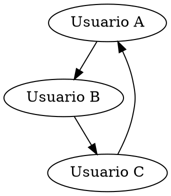

# Manual Técnico del Sistema de Gestión de Red Social

Este documento proporciona detalles técnicos sobre el sistema de gestión de red social, incluyendo la estructura del código, la lógica detrás de las funcionalidades principales y la forma en que se gestionan los datos. Está dirigido a desarrolladores que desean entender, mantener o expandir el sistema.

## Requisitos Técnicos

- **Lenguaje de programación:** C++
- **Compilador recomendado:** TDM-GCC 9.2.0 / MinGW / Dev-C++
- **Entorno de desarrollo:** Visual Studio Code
- **Herramientas adicionales:**
  - [Graphviz](https://graphviz.org/): Para la generación de gráficos en formato `.dot`.

## Estructura del Proyecto

El proyecto está dividido en múltiples archivos para mejorar la modularidad y organización:

- **`main.cpp`:** Contiene el flujo principal del programa y los menús interactivos.
- **`ListaEnlazada.h` y `ListaEnlazada.cpp`:** Define la estructura de datos para manejar los usuarios registrados en el sistema. Implementa operaciones como agregar, buscar y eliminar usuarios.
- **`Usuario.h` y `Usuario.cpp`:** Contiene la clase `Usuario`, que maneja los datos personales y las relaciones de cada usuario.
- **`MatrizDispersa.h` y `MatrizDispersa.cpp`:** Implementa la matriz dispersa para gestionar las relaciones de amistad entre los usuarios.
- **`ListaDoblePublicaciones.h` y `ListaDoblePublicaciones.cpp`:** Implementa la lista doblemente enlazada utilizada para almacenar y mostrar publicaciones.
- **`Solicitud.h` y `Solicitud.cpp`:** Módulo que gestiona las solicitudes de amistad, tanto enviadas como recibidas.
- **`reportes/`:** Directorio que contiene los archivos `.dot` generados para los gráficos de relaciones, solicitudes y publicaciones.

## Descripción de Clases y Estructuras

### 1. **Clase `Usuario`**

Contiene atributos como nombre, correo, contraseña, listas de solicitudes y publicaciones. Sus métodos principales incluyen:

- `getCorreo()`: Retorna el correo del usuario.
- `getSolicitudesRecibidas()`: Retorna la pila de solicitudes recibidas.
- `getSolicitudesEnviadas()`: Retorna la lista de solicitudes enviadas.

### 2. **Clase `ListaEnlazada`**

Gestión de los usuarios en el sistema:

- `agregarUsuario(Usuario nuevoUsuario)`: Agrega un usuario al final de la lista.
- `buscarUsuarioPorCorreo(std::string correo)`: Busca y retorna un puntero al usuario según su correo.
- `eliminarUsuario(std::string correo)`: Elimina un usuario de la lista según su correo.

### 3. **Clase `MatrizDispersa`**

Estructura que almacena las relaciones de amistad entre usuarios en una matriz dispersa. Principales métodos:

- `agregarAmistad(std::string usuario1, std::string usuario2)`: Añade una relación de amistad bidireccional.
- `existeAmistad(std::string usuario1, std::string usuario2)`: Verifica si existe una relación entre dos usuarios.
- `obtenerAmigos(std::string usuario)`: Retorna una lista o pila con los amigos de un usuario.

### 4. **Clase `ListaDoblePublicaciones`**

Estructura para manejar las publicaciones de los usuarios:

- `agregarPublicacion(std::shared_ptr<Publicacion> publicacion)`: Inserta una nueva publicación.
- `eliminarPublicacionesPorUsuario(std::string correoUsuario)`: Elimina todas las publicaciones de un usuario específico.
- `mostrarPublicaciones()`: Muestra todas las publicaciones en la lista.

### 5. **Clase `Solicitud`**

Gestión de solicitudes de amistad:

- `agregarSolicitud(std::string correoReceptor)`: Agrega una solicitud a la lista.
- `buscarSolicitud(std::string correo)`: Verifica si existe una solicitud pendiente para el correo especificado.
- `eliminarSolicitud(std::string correo)`: Elimina una solicitud específica.

## Flujo del Sistema

1. **Registro e Inicio de Sesión:**
   - Los usuarios se registran proporcionando su nombre, correo y contraseña. Estos se almacenan en la lista enlazada de usuarios.
   - El inicio de sesión valida las credenciales y, si son correctas, redirige al perfil del usuario.

2. **Gestión de Solicitudes:**
   - Las solicitudes de amistad se almacenan en listas o pilas según el estado (enviadas o recibidas).
   - Al aceptar una solicitud, la relación de amistad se agrega a la matriz dispersa.

3. **Publicaciones:**
   - Las publicaciones se almacenan en una lista doblemente enlazada global. Esta lista permite mostrar tanto las publicaciones propias como las de amigos.

4. **Eliminación de Cuenta:**
   - Al eliminar una cuenta, se eliminan los datos del usuario, las relaciones de amistad y las publicaciones asociadas.

5. **Generación de Reportes:**
   - El sistema genera gráficos `.dot` usando Graphviz para representar la red de amigos, las solicitudes y las publicaciones.

## Diagramas y Gráficos

### Generación de Gráficos con Graphviz

El sistema utiliza archivos `.dot` para generar gráficos. A continuación, un ejemplo básico de cómo se genera un gráfico:



## Implementación Técnica de Funciones Clave

### 1. **Carga Masiva de Solicitudes**

El sistema permite la carga de solicitudes desde un archivo JSON. Este archivo se lee y las solicitudes se procesan automáticamente. A continuación, se describe el proceso:

1. El archivo JSON se abre y se parsea utilizando la librería correspondiente.
2. Para cada solicitud en el archivo:
   - Se extraen los datos del emisor, receptor y el estado de la solicitud.
   - Se verifica que ambos usuarios existan en el sistema.
   - Dependiendo del estado de la solicitud (`PENDIENTE` o `ACEPTADA`), se realizan las operaciones adecuadas:
     - **PENDIENTE:** Se agrega la solicitud a las listas/pilas correspondientes.
     - **ACEPTADA:** Se eliminan las solicitudes pendientes y se agrega la relación de amistad a la matriz dispersa.
3. Se actualiza la lista global de relaciones de amistad.

Este enfoque garantiza que las relaciones de amistad se manejen correctamente y que no haya duplicación de datos.

### 2. **Eliminación de Publicaciones por Usuario**

Cuando un usuario decide eliminar su cuenta, el sistema se encarga de eliminar todas sus publicaciones asociadas. Este proceso se realiza a través del método `eliminarPublicacionesPorUsuario`, que sigue los siguientes pasos:

1. Se recorre la lista doblemente enlazada de publicaciones.
2. Para cada publicación, se verifica si pertenece al usuario que se va a eliminar.
3. Si la publicación coincide, se elimina el nodo correspondiente de la lista doblemente enlazada.
4. El proceso continúa hasta que se hayan eliminado todas las publicaciones del usuario.

Este método asegura que no queden publicaciones huérfanas en el sistema tras la eliminación de una cuenta.

### 3. **Navegación entre Publicaciones**

El sistema implementa una lista doblemente enlazada para gestionar las publicaciones de los usuarios y sus amigos. Esta estructura permite la navegación bidireccional mediante punteros a los nodos anterior y siguiente. La funcionalidad se implementa así:

1. Cada publicación se almacena en un nodo que contiene punteros al nodo anterior y al siguiente.
2. Los métodos `mostrarPublicacionesSiguiente()` y `mostrarPublicacionesAnterior()` permiten al usuario moverse a través de las publicaciones:
   - `mostrarPublicacionesSiguiente()`: Avanza al siguiente nodo en la lista.
   - `mostrarPublicacionesAnterior()`: Retrocede al nodo anterior.
3. Esta estructura facilita la navegación intuitiva y eficiente a través del contenido.

### 4. **Generación de Gráficos con Graphviz**

El sistema genera gráficos `.dot` para representar las relaciones de amistad, las solicitudes y las publicaciones. El proceso es el siguiente:

1. Se generan archivos `.dot` con la sintaxis de Graphviz que describen la estructura de los datos.
2. Los archivos `.dot` se pueden convertir a imágenes (como PNG) utilizando comandos como:
   ```bash
   dot -Tpng archivo.dot -o salida.png

 3. Ejemplos de gráficos generados incluyen:

- La red de relaciones de amistad en la matriz dispersa.
- Las solicitudes enviadas y recibidas en forma de listas y pilas.
- La lista circular doblemente enlazada de publicaciones.

Estos gráficos son útiles para visualizar la estructura interna del sistema y proporcionar informes visuales a los usuarios.

## Recomendaciones para la Expansión del Sistema

1. **Optimización de Búsquedas:**
   Considera implementar algoritmos de búsqueda más eficientes, como tablas hash, para mejorar el rendimiento al buscar usuarios o publicaciones.

2. **Implementación de Cache:**
   Para sistemas con un gran número de usuarios, la implementación de una capa de cache podría reducir los tiempos de acceso y mejorar la experiencia del usuario.

3. **Seguridad y Encriptación:**
   Asegura que las contraseñas se almacenen de manera segura utilizando técnicas de hashing y salting. Además, implementar validaciones y controles de sesión es esencial para proteger la integridad de los datos.

## Consideraciones Finales

Este proyecto está diseñado para ser modular, escalable y adaptable a futuras expansiones. El uso de estructuras de datos eficientes y la gestión cuidadosa de la memoria mediante punteros inteligentes aseguran la estabilidad y el rendimiento del sistema. Cualquier modificación o expansión debe seguir los principios establecidos para mantener la consistencia y eficiencia.
