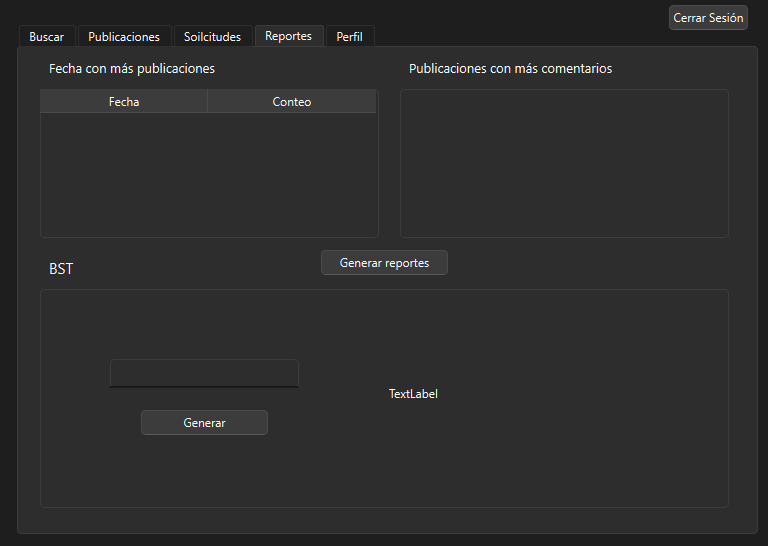

# Manual de Usuario - Proyecto Sistema de Red Social

## Índice
1. [Introducción](#introducción)
2. [Requisitos del Sistema](#requisitos-del-sistema)
3. [Instalación](#instalación)
4. [Estructura del Proyecto](#estructura-del-proyecto)
5. [Funciones Principales](#funciones-principales)
    - [1. Registro de Usuarios](#1-registro-de-usuarios)
    - [2. Inicio de Sesión](#2-inicio-de-sesión)
    - [3. Gestión de Solicitudes de Amistad](#3-gestión-de-solicitudes-de-amistad)
    - [4. Publicaciones](#4-publicaciones)
    - [5. Administración de Amigos](#5-administración-de-amigos)
    - [6. Eliminación de Cuenta](#6-eliminación-de-cuenta)
    - [7. Reportes y Gráficos](#7-reportes-y-gráficos)
6. [Guía de Uso](#guía-de-uso)
7. [Resolución de Problemas](#resolución-de-problemas)
8. [Consideraciones Finales](#consideraciones-finales)

## Introducción

Este proyecto es un sistema de red social desarrollado en C++ que permite a los usuarios interactuar mediante la gestión de amistades, envío y aceptación de solicitudes, publicación de mensajes y visualización de reportes. A lo largo del desarrollo, se ha utilizado una estructura de datos eficiente, como listas enlazadas, pilas, colas y matrices dispersas para manejar grandes volúmenes de datos.

Este manual tiene como objetivo guiar al usuario en el uso de las funcionalidades del sistema, brindando instrucciones detalladas para su instalación y operación.

## Requisitos del Sistema

Antes de instalar y ejecutar el sistema, asegúrate de contar con los siguientes requisitos:

- **Sistema Operativo:** Windows, macOS, o Linux
- **Compilador:** TDM-GCC 9.2.0 (recomendado), o cualquier compilador C++ compatible con C++11 o superior
- **Entorno de Desarrollo:** Embarcadero Dev-C++ o cualquier IDE compatible con proyectos C++
- **Herramientas adicionales:** Graphviz para la generación de gráficos.

## Instalación

1. **Clona el repositorio o descarga el proyecto:**
   ```bash
   git clone https://github.com/usuario/proyecto-red-social.git

## Estructura del Proyecto

El proyecto está organizado en los siguientes archivos y directorios:

- `main.cpp`: Archivo principal donde se encuentra el menú principal y la lógica base del programa.
- `ListaEnlazada.h` y `ListaEnlazada.cpp`: Implementación de la estructura de datos para manejar los usuarios registrados.
- `MatrizDispersa.h` y `MatrizDispersa.cpp`: Estructura para manejar la matriz dispersa que representa las relaciones de amistad.
- `ListaDoblePublicaciones.h` y `ListaDoblePublicaciones.cpp`: Estructura de lista doblemente enlazada para almacenar las publicaciones de los usuarios.
- `Solicitud.h` y `Solicitud.cpp`: Módulo encargado de gestionar las solicitudes de amistad.
- `Usuario.h` y `Usuario.cpp`: Contiene la definición y gestión de los objetos `Usuario`.
- `reportes/`: Directorio que contiene archivos auxiliares para la generación de reportes gráficos con Graphviz.

## Funciones Principales

### 1. Registro de Usuarios

Permite a nuevos usuarios registrarse en el sistema mediante la introducción de un nombre, correo electrónico y contraseña. Los usuarios registrados se almacenan en la lista enlazada.


### 2. Inicio de Sesión

Función que verifica las credenciales del usuario y permite acceder al sistema. Si las credenciales son correctas, se redirige al menú del perfil.


### 3. Gestión de Solicitudes de Amistad

El sistema permite enviar, aceptar y rechazar solicitudes de amistad. Estas se almacenan en una pila y una cola según su estado, y pueden visualizarse en el perfil del usuario.


### 4. Publicaciones

Los usuarios pueden crear publicaciones que se almacenan en una lista doblemente enlazada. Esta lista es global y permite visualizar tanto las publicaciones propias como las de los amigos.


### 5. Administración de Amigos

El sistema gestiona las relaciones de amistad mediante una matriz dispersa que registra las conexiones entre usuarios. Al aceptar una solicitud, la relación de amistad se actualiza en la matriz.


### 6. Eliminación de Cuenta

Permite al usuario eliminar su cuenta, lo que implica eliminar sus datos, publicaciones y relaciones de amistad. Una vez realizada la eliminación, el usuario regresa al menú principal.


### 7. Reportes y Gráficos

El sistema genera gráficos usando Graphviz para representar visualmente la red de amigos, las solicitudes y las publicaciones. Estos gráficos se generan en formato `.dot` y pueden visualizarse usando herramientas compatibles.



## Guía de Uso

1. **Registro e Inicio de Sesión:** Al iniciar la aplicación, elige la opción para registrarte o iniciar sesión. Ingresa los datos solicitados.
2. **Gestión de Amistades:** Una vez dentro, puedes enviar solicitudes de amistad a otros usuarios, aceptar o rechazar solicitudes recibidas.
3. **Crear Publicaciones:** Desde el perfil, puedes añadir nuevas publicaciones que serán visibles tanto para ti como para tus amigos.
4. **Visualizar Publicaciones:** Accede a la sección de publicaciones para ver las tuyas y las de tus amigos.
5. **Eliminar Cuenta:** Si deseas eliminar tu cuenta, puedes hacerlo desde la configuración de tu perfil.

## Resolución de Problemas

- **Error al abrir el archivo de solicitudes:** Asegúrate de que el archivo existe y está en la ubicación correcta.
- **Problemas de compatibilidad al compilar:** Verifica que estás usando el compilador recomendado y que las opciones de C++11 están habilitadas.
- **Los gráficos no se generan:** Asegúrate de tener Graphviz instalado y configurado correctamente en tu sistema.

## Consideraciones Finales

Este sistema fue diseñado para gestionar eficientemente la información utilizando estructuras de datos dinámicas. A medida que el sistema crezca, considera optimizar las operaciones de búsqueda y gestión de datos. Además, asegúrate de realizar pruebas regulares para mantener la estabilidad del sistema.
